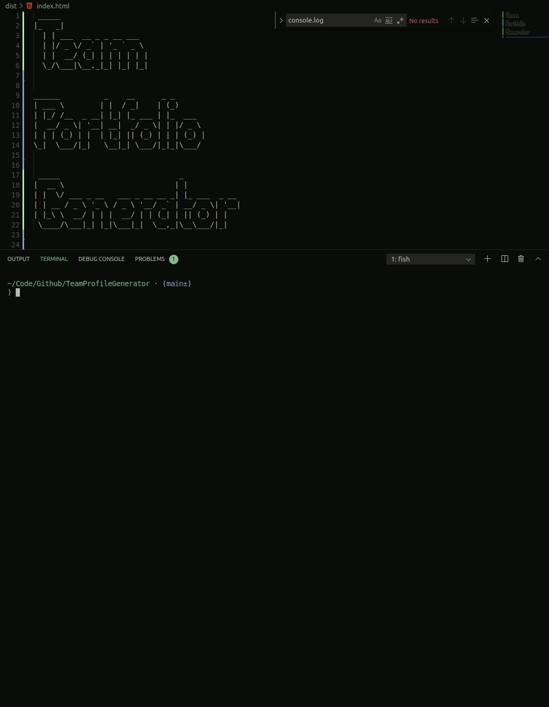

## Team Profile Generator

Dev team profile generator written in Node.js following the Test Driven Development model with jest.

#### Issues

- [x] [Create & Test Employee Class](https://github.com/MBrassey/TeamProfileGenerator/issues/1)
- [x] [Create & Test Remaining Classes](https://github.com/MBrassey/TeamProfileGenerator/issues/2)
- [x] [Validate Input & Generate HTML](https://github.com/MBrassey/TeamProfileGenerator/issues/3)
- [x] [Refactor / Finishing Touches](https://github.com/MBrassey/TeamProfileGenerator/issues/4)

#### Requirements

- node.js
- npm

#### Installation

    npm i

#### Usage

    Usage: node app.js [ -h | -v | -l | -a ]

    [options]

    -h          Display this message.
    -v          Show version.
    -l          Show license info.
    -a          What is TeamProfileGenerator?

[
](https://mbrassey.github.io/TeamProfileGenerator/)

[
](https://mbrassey.github.io/TeamProfileGenerator/)

#### Questions

Contact me at [matt@brassey.io](mailto:matt@brassey.io) with any questions or comments.

#### License

`TeamProfileGenerator` is published under the **CC0_1.0_Universal** license.

> The Creative Commons CC0 Public Domain Dedication waives copyright interest in a work you've created and dedicates it to the world-wide public domain. Use CC0 to opt out of copyright entirely and ensure your work has the widest reach. As with the Unlicense and typical software licenses, CC0 disclaims warranties. CC0 is very similar to the Unlicense.
